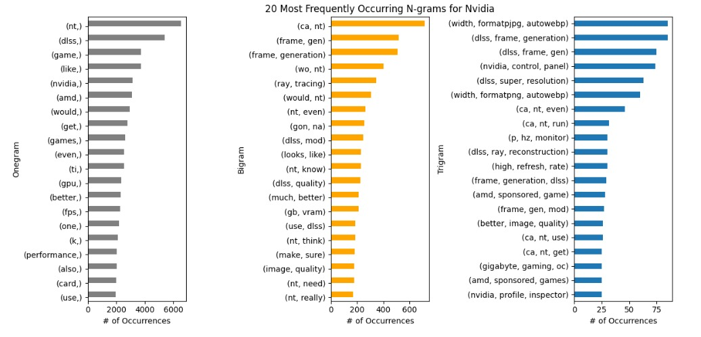

# Subreddit Classification using Natural Language Processing (NVIDIA vs AMD) 

## Introduction
**Reddit** is a network of communities where people can post comments and discuss just about any topic under the sun. Each community is known as a Subreddit.
 **AMD** and **Nvidia** are two major competitors in the graphic cards manufacturing space, with AMD widely regarded as the more "budget" option and hence market perception is that they are of lower quality. This project will be leveraging the AMD and Nvidia subreddit communities and their comments as the database.

The goal of this project is to **classify whether a post belongs to the AMD or Nvidia Subreddit community**, based on its content. This serves the purpose of helping the teams in either companies understand netizen's feedback on their products, allowing them to do some root cause analysis and optimise allocation of resources in either engineering or marketing departments (depending on where the issues seem to lie).

## Methodology

1. Data Collection using PRAW API to scrape Subreddit posts
2. Data Processing and EDA 
3. Machine Learning Modelling & Tuning

## Data Collection

Using PRAW API, I scraped a total of 500 "new" posts (including comments) from each Nvidia and AMD subreddit. I included comments / replies in response to posts as this is also meaningful text data worth analysing and training the model with. Total no. of rows of comments: ~60,000.

## Executive Summary

### Model Selection & Evaluation
Best Model: **Logistic Regression with TFIFD Vectorizer**
F1 Score: 81%
Accuracy: 75%
Model is able to accurately classify 75% of posts.

In summary, the best parameters were:
- Model: Logistic Regression
- Transformer: TFIFD Vectorizer
- Max Features: None
- Max_df = 0.75: ignore terms that appear in more than 75% of the documents
- Min_df = 2: term must appear in at least 2 documents 
- Bigrams

### Top n-grams for AMD and Nvidia
AMD comments had more negative n-grams like: "rude, uncivil, language" versus Nvidia's positive n-grams like "high, refresh, rate".

 

### Sentiment Analysis

Using VADER, for sentiment analysis: Negative posts in r/AMD, is **35%** higher than in r/Nvidia. This concurs with the high frequency n-grams seen.

## Recommendations:

1. Re-allocation of resources:
Focus on Technical Quality - Allocate additional engineering resources to enhance technical quality, with emphasis on image quality and power consumption for AMD products.

2. Sentiment Monitoring:
Implement Pre-launch Testing. Conduct thorough sentiment analysis through testing or soft launches before product launches to address issues proactively.

3. Benchmarking:
Gain Competitive Insights. Consider benchmarking AMD products against Nvidia's offerings to glean competitive advantages.

## Future Steps

1. Collect More Data:
- Expand Dataset: Gather additional Reddit post data and data from diverse sources.
- Enhance Models: Increase dataset size to boost classification and sentiment analysis performance.

2. Market Research:
- Gain Context: Conduct market research to deepen contextual understanding.
- Terminology Awareness: Improve familiarity with industry-specific terms and techniques.

3. Advanced NLP Techniques:**
- Utilize Pre-trained Models: Implement advanced NLP methods like BERT.
- Deep Learning with CNNs: Explore CNNs to capture local text patterns - ideal for tasks like sentiment analysis.

## Author

- [@Tiffany](https://github.com/tiffanytgr/data-science-projects)